# 💫 About Me:

- 🔭 I am currently working on enhancing the Windows user experience to maximize productivity. I use open-source software and share my config files through dedicated repositories. My goal is to let anyone copy my entire setup and make it work in seconds with a single terminal command.

- 🌱 I am currently learning about Python, Rust, and golang

- ​🤔 I am always open to tips and guidance on Python, Rust, and Go! Transitioning from Bash and PowerShell scripting to handling complex logic and data structures in these languages has been a steep but exciting learning curve.
  
- ​💬 Ask me about anything! I would be absolutely thrilled to answer questions about my Windows ricing workflow, my projects, or my day-to-day coding journey.

- ⚡ Fun fact I am 10th grader. Coffee runs my life. 
  
> [!NOTE]
>  If you find me without coffee! get help!

## 🌐 Socials:
   

## 💻 Tech Stack:
      

Here are my GitHub and Coding statistics:

  

<!--
**Aniruddha69/Aniruddha69** is a ✨ _special_ ✨ repository because its `README.md` (this file) appears on your GitHub profile.

Here are some ideas to get you started:

- 🔭 I’m currently working on ...
- 🌱 I’m currently learning ...
- 👯 I’m looking to collaborate on ...
- 🤔 I’m looking for help with ...
- 💬 Ask me about ...
- 📫 How to reach me: ...
- 😄 Pronouns: ...
- ⚡ Fun fact: ...
-->
